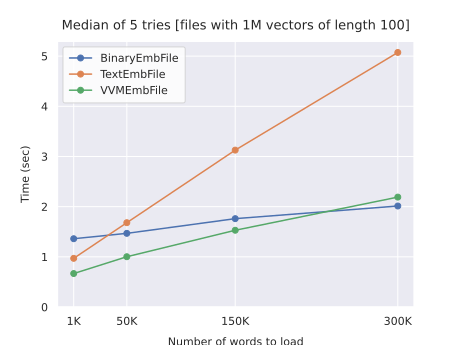
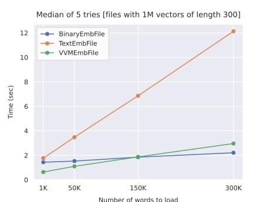
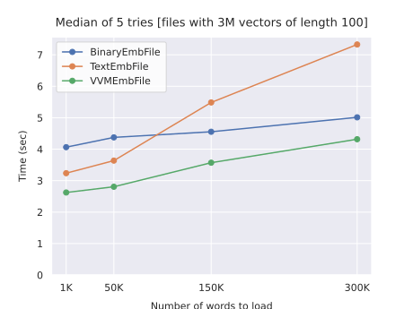
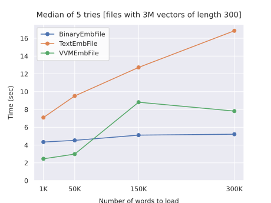

==================
Formats benchmark
==================

Description
===========
This section is about a benchmark I did out of curiosity for comparing the performance of the
formats supported by this library. The snippet under test is the following::

    with ConcreteEmbFile(path, verbose=0) as f:
        f.find(query)

The benchmark was performed on generated files for increasing input sizes (number of words to load).
For each input size, the test was repeated 5 times with the exact same input.
The script used for running this tests is in the ``benchmark`` folder of the repository.

The inputs were obtained as following:

#. first, a list of ``max(input_sizes)`` words was (uniformly) sampled from the file vocabulary
#. the input for size ``k`` was obtained taking

   - the first ``k`` words of the sampled list
   - an additional out-of-file-vocabulary word

So, the input for the ``i``-th size is a super-set of the previous ones.

Some notes
----------
#. The additional out-of-file-vocabulary word forces txt and bin file objects to read the entire
   file. The number of missing words isn't an interesting parameter to consider, since missing words
   are simply added to a set in all the cases.

#. The input sizes reported below don't consider the additional word: the actual input size
   is ``reported_size + 1``, but that's practically irrelevant.

#. The measured times (on each single try) include the time for opening the file; VVM files can
   take several seconds to open since the vocabulary is entirely read at the start; thus the actual
   time taken by only :meth:`~embfile.core.EmbFile.find` in VVM files is lower that those reported
   below.

System used for tests
---------------------
Tests were performed on an old desktop computer upgraded with a SSD:

- **CPU:** Intel® Core™2 Quad Q6600
- **RAM:** 8GB DDR2 (4 x 2GB, 800Mhz)
- **SSD:** Samsung 850 EVO 256GB
- **OS:** Windows 10

Expect much better times on newer computers.

Results
=======
Files with 1M vectors of size 100
---------------------------------

.. include:: ../benchmark/tables/1000000_100__5_reps_median.rst

|

Files with 1M vectors of size 300
---------------------------------

.. include:: ../benchmark/tables/1000000_300__5_reps_median.rst

|

Files with 3M vectors of size 100
---------------------------------

.. include:: ../benchmark/tables/3000000_100__5_reps_median.rst

|

Files with 3M vectors of size 300
---------------------------------

.. include:: ../benchmark/tables/3000000_300__5_reps_median.rst

|
